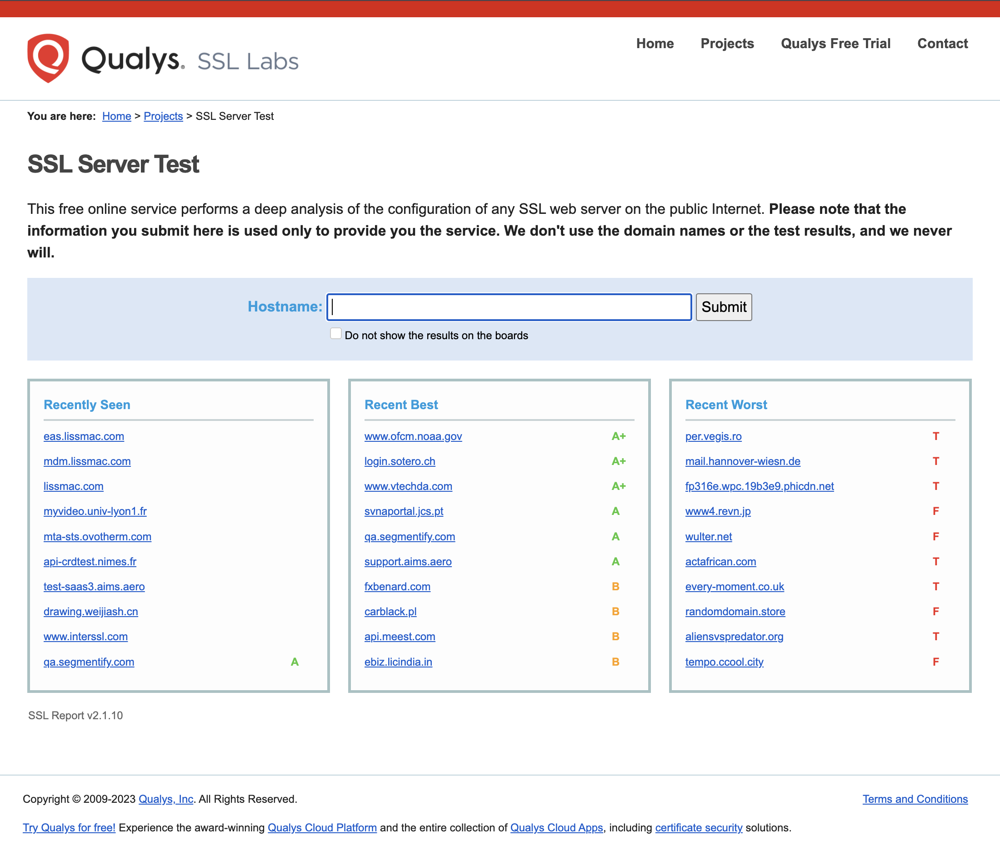

<br>
Translated into English - [Yandex Translate](https://translate.yandex.com/).

## 🏆 Getting an A+ rating in SSL Labs using Traefik and Let's Encrypt

> The repository was created to maintain the current configuration of the SSL server using Traefik in terms of deploying a secure site or web application. The minimum possible Traefik setup is considered (free Let's Encrypt certificates are used) to get the highest score according to testing data [SSL Labs](https://www.ssllabs.com/ssltest/). In the future, it is planned to expand the testing area with the help of [The Mozilla Observatory](http://observatory.mozilla.org/) and other services.


## 💻 How to use

1. Clone the repository to your server:
```bash
git clone https://github.com/pkashin/sslRating.git
```

2. Create DNS records for your domain name (for example `example.com`) and subdomains `traefik.example.com` to display the Traefik dashboard. As values, specify the IP address of your server on which Traefik will be deployed.

3. Open the `.env.example` file and change the environment variables with your real data. Rename and save the `.env.example` file to `.env`.
   - `ACME_EMAIL` - email address that will be used to register the certificate.
   - `DOMAIN` - domain name for which the certificate will be issued.
```ini
# .env.example
ACME_EMAIL=email@example.com
DOMAIN=example.com
```

4. Go to the `sslRating` directory and start the containers:
```bash
cd sslRating/
docker-compose up -d
```

5. Certificates will be formed in the file `/sslRating/traefik/acme/acme.json`.

6. Go to the [SSL Labs](https://www.ssllabs.com/ssltest/) website and enter the domain name you want to test. Click the `Submit` button.


